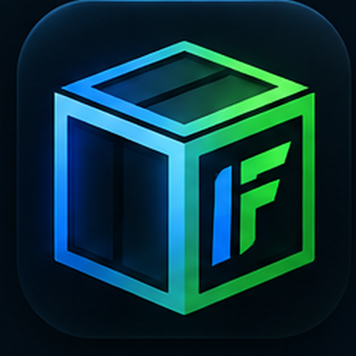

# ItemFuse

<p align="center">
  
</p>

<p align="center">
  <strong>Trade smarter. Find the item that fits.</strong>
</p>

ItemFuse is a non-custodial CS2 trading platform for discovering traders, comparing exact item data, negotiating item-for-item offers, and completing the final exchange through Steam.

Production: https://itemfuse.com

> ItemFuse is an independent trading utility and is not affiliated with Valve Corporation.

## What ItemFuse does

- Signs users in with Steam OpenID without receiving Steam passwords or Steam Guard codes.
- Syncs public CS2 inventories and stores user inventory snapshots in Neon Postgres.
- Enriches supported items with float, paint seed, paint index, phase, fade, Blue Gem data, stickers, charms, patches, inspect links, and market pricing.
- Applies CS2 rarity-based item-card themes across the app.
- Provides inventory search, filters, sorting, tradability filters, and estimated value ranges.
- Supports wishlists, public trade listings, Discover, reciprocal matches, and Steam-friend browsing.
- Supports direct friend offers for ItemFuse users with synced inventories.
- Supports multi-item offers, counters, acceptance, rejection, cancellation, messages, and notifications.
- Hands accepted trades back to Steam for the final exchange. ItemFuse never takes custody of items.
- Includes an ItemFuse appraisal engine that combines current market references, float quality, Blue Gem signals, Fade/Doppler signals, and optional historical market calibration.

## Tech stack

- **Framework:** Next.js 16 / React 19 / TypeScript
- **Hosting:** Vercel
- **Database:** Neon Postgres via `@neondatabase/serverless`
- **Authentication:** Steam OpenID 2.0
- **Steam data:** Steam Community inventory endpoints + Steam Web API
- **Item enrichment / market history:** Steam Data API when configured

## Project structure

```text
app/
  api/                  Server-side API routes
    appraisal/          Historical appraisal calibration
    auth/               Steam login, callback, logout
    catalog/            Item search and sticker reference pricing
    friends/            Friend inventory/public-status checks
    inventory/          Inventory synchronization
    listings/           Public trade listings
    messages/           Trade-thread messaging
    notifications/      Notification actions
    offers/             Standard, direct, and offer-status actions
    profile/            User trade URL settings
    wishlist/           Wishlist actions
  discover/             Discover marketplace
  friends/              Steam friend browsing
  matches/              Reciprocal trade matches
  notifications/        User alerts
  offers/               Offer builder and offer detail views
  trades/               Listings and trade management
  wishlist/             Wishlist UI
  page.tsx               Landing page + signed-in inventory

components/              Shared interactive UI
lib/
  appraisal.ts           ItemFuse appraisal engine
  catalog.ts             Item catalog helpers
  db.ts                  Neon queries and core trade logic
  item-display.ts        Shared item-display normalization
  item-rarity-theme.ts   CS2 rarity visual mapping
  market-history.ts      Historical market calibration
  public-url.ts          Canonical production URL handling
  session.ts             Signed ItemFuse session cookies
  steam.ts               Steam inventory, enrichment, and friends logic

docs/archive/patch-notes/ Historical implementation notes from the patch-based development phase
public/                    ItemFuse brand assets
proxy.ts                  Canonical-host redirect logic
```

## Environment variables

Create `.env.local` for local development or configure these in Vercel for production.

```env
APP_URL=https://itemfuse.com
DATABASE_URL=postgresql://...
SESSION_SECRET=replace-with-a-random-secret-at-least-32-characters
STEAM_WEB_API_KEY=...
STEAMDATA_API_KEY=...
```

### Required

- `DATABASE_URL` — Neon pooled PostgreSQL connection string.
- `SESSION_SECRET` — secret used to HMAC-sign ItemFuse sessions; must be at least 32 characters.

### Production / feature-specific

- `APP_URL` — canonical public origin. Production should use `https://itemfuse.com`.
- `STEAM_WEB_API_KEY` — required for Steam friend-list and player-summary features.
- `STEAMDATA_API_KEY` — enables exact item enrichment and supported market-history features.

Never commit real environment-variable values. `.env*`, `.vercel`, `.next`, and `node_modules` are ignored by Git.

## Local development

```bash
npm install
npm run dev
```

Then open `http://localhost:3000`.

Create a local `.env.local` containing the required environment variables before testing authenticated/database-backed features.

## Production build

```bash
npm run build
npm start
```

For the current Vercel workflow:

```bash
vercel --prod
```

## Authentication and security model

ItemFuse uses Steam OpenID for identity verification:

1. ItemFuse redirects the browser to `steamcommunity.com`.
2. Steam authenticates the user.
3. Steam returns a signed OpenID assertion containing the SteamID.
4. ItemFuse verifies that assertion directly with Steam.
5. ItemFuse creates a signed HTTP-only session cookie.

ItemFuse does **not** receive or store Steam passwords, Steam Guard codes, or Steam login cookies.

The application is intentionally non-custodial. ItemFuse does not operate a deposit bot and does not hold user skins. Accepted ItemFuse offers are completed through Steam, where both users must verify the final trade contents themselves.

## Inventory privacy

Steam privacy settings still apply. ItemFuse cannot bypass a private inventory or private friends list. Inventory synchronization requires the relevant Steam inventory to be publicly accessible.

## ItemFuse appraisal engine

The appraisal engine produces an estimated range rather than pretending every exact item has a single precise value.

It can use:

- available current market references
- historical Steam sale medians when available
- historical marketplace observations when available
- market trend and volatility
- Doppler phase history when available
- normalized float quality within the item's wear band
- Blue Gem tier, weighted blue coverage, and rank
- Fade percentage
- Doppler phase signals

Rare patterns, elite floats, applied stickers, low-liquidity collector items, and one-of-one combinations can trade outside the model range. ItemFuse appraisals are estimates, not guaranteed sale prices.

## Database

ItemFuse currently expects the existing Neon schema used by production. Core persisted areas include users, inventory items, listings, wanted items, wishlists, trade threads, offers, offer items, messages, notifications, and supporting cache data.

**A fresh-database migration/bootstrap workflow is not yet checked into this repository.** Cloning the repository alone is therefore not enough to create a new empty production database from scratch. Adding versioned migrations is a recommended next infrastructure step.

## Current development notes

- Historical patch notes from the early patch-based development workflow are archived under `docs/archive/patch-notes/` and are not required at runtime.
- There is currently no GitHub Actions CI workflow in the repository. Production builds are validated through the local/Vercel build workflow.
- Some provider-backed features degrade gracefully when their optional API key or provider plan is unavailable.

## Safety reminders

ItemFuse should never ask a user to:

- send a skin to an ItemFuse verification bot
- deposit an item to unlock trading
- provide a Steam Guard code
- provide a Steam password
- provide Steam session cookies
- install a trading browser extension to use ItemFuse

Always verify the final account and exact items inside Steam before submitting or accepting a Steam trade offer.
